## Verify connectivity to Redpanda

Prometheus is configured to connect to the Redpanda cluster in its configuration file:

```bash,run
cat config/prometheus/prometheus.yml
```

In this file, the `scrape_configs` section has a job `redpanda`, and the static config targets list each broker. Prometheus will need to be updated over time as you commission/decommission new brokers.

Open the [button label="Prometheus"](tab-1) and start typing `redpanda_` in the expression input field.

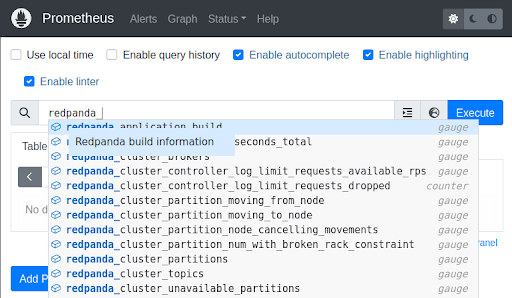

You should see Redpanda metrics in the dropdown list. Now you have verified that Prometheus is pulling metrics from Redpanda. This is an important first step, as all charts and alerts in both Prometheus and Grafana rely on Prometheus to scrape Redpanda metrics.

## Alert definition file

The `alert-definitions` file is used to define alerts for either Prometheus or Grafana. The following command shows a portion of this file:

```bash,run
head -20 config/alert-definitions.yml
```

Once you have found the Redpanda metrics for the alert you want, you can modify this file with a new alert definition and then run the following python script:

```bash,run
head -20 alert-generation/generate.py
```

This script generates alert config files for Prometheus and/or Grafana (by default it generates both). More details on how to run this script are [here](https://github.com/redpanda-data/observability/blob/main/alert-generation/README.md). We'll run this script to generate a new alert definition once we progress further through this scenario.

> Note: Production deployments would likely use alerting from only one of these tools, but we are generating alerts in this environment for both tools.

## View alerts in Prometheus

The [button label="Prometheus"](tab-1) page shows the status and details for each alert. If you wanted to modify these alerts, you would edit the `alert-rules` file and then restart Prometheus. This file is located here:

```bash,run
head -20 config/prometheus/alert-rules.yml
```

Remember that the alert-generation script mentioned above can generate this file for you! We will leave these alerts at their default values for now.

## View alerts in Grafana

The [button label="Grafana Alert"](tab-3)  page shows alerts defined in the Grafana config:

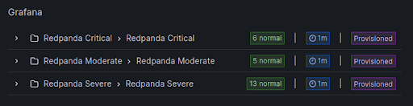

But if you have configured Prometheus alerts they will also show up here:

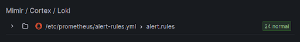

> Note: You can only silence Grafana alerts here (not the alerts for Prometheus). Silencing alerts ensures no notifications will be sent out for any matching alerts. This does not mean the alerts won't continue to fire in Grafana!

## Send test email

When an alert fires, a notification can be sent to various contact points. This environment has a default email contact point configured in [button label="Grafana"](tab-4):

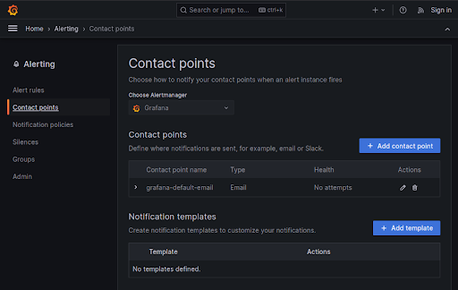

Click the edit action button, then click the "Test" button, and then click "Send test notification". This will fire off an email to that you can read in your [button label="Inbox"](tab-2) :


## Explore metrics

Grafana is already populated with several good charts for monitoring Redpanda. It's likely that the metrics you care about are already being used on one of these dashboards to provide an interesting visualization.

More details on these charts are available [here](https://github.com/redpanda-data/observability) and [here](https://docs.redpanda.com/docs/manage/monitoring/#use-redpanda-monitoring-examples).

## Create a custom visualization

Let's create a line chart focused on storage used. This chart will show a single growing from the bottom-left to top-right, like this example:

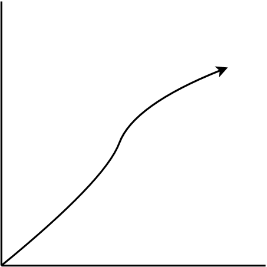

First we need to find the metrics tied to storage, and one of the best ways to find this is by looking at some of the existing related charts.

Open `Redpanda Default Dashboard` in [button label="Grafana"](tab-3), then expand the storage section at the bottom of the page:

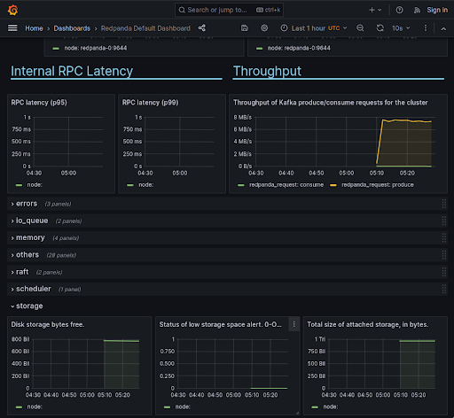

The chart named Disk storage bytes free is close to what we want:

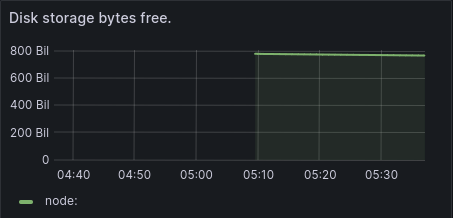

But it has a few issues:
1. The y-axis could be improved
2. This shows the amount of free space rather than the disk used

Let's create a new dashboard, and then create two charts based on similar data as this. The modification will be to subtract the current value shown from `redpanda_storage_disk_total`. This will give a constantly-increasing value that can be used to draw the line chart we want.

Click the toggle menu in the top left and then choose "Dashboards". Then click the blue "New" button in the top right and choose "New Dashboard":

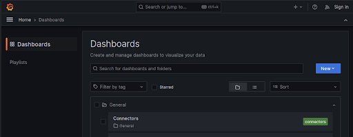

You will then see your new (empty) dashboard:

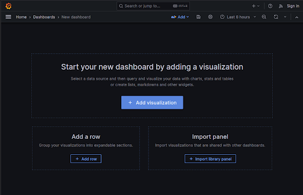

Now click "Add visualization", and on the next screen choose the Prometheus data source. You will then see the following chart details:

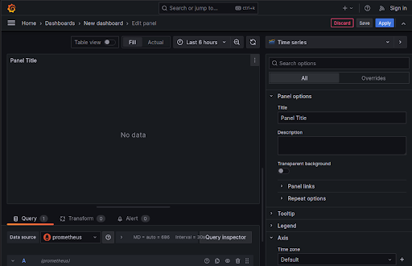

Take the following actions:

- In "Panel options" section, update the title to "Raw storage used"
- In the "Axis" section, update the time zone
- In the "Standard options" section, set unit to "Number" (found under "Misc")
- In the "Query" tab at the bottom, set the formula to the following:

```
sum(redpanda_storage_disk_total_bytes{instance="redpanda-0:9644"}) - sum(redpanda_storage_disk_free_bytes{instance="redpanda-0:9644"})
```

> Note: You may have to change the query mode from "Builder" to "Code" to see the PromQL input field.

You should now see a blue "Run queries" button just above the PromQL input field. Clicking that button will show the line chart we want:

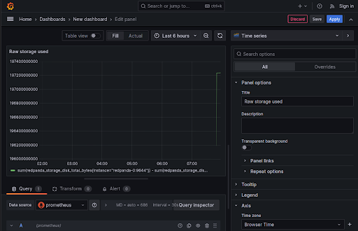

Click Apply in the top right corner, and your chart will be shown in your new dashboard.

We can make this value easier to see by creating another chart using the "Stat" visualization. Click the ellipses in the top right of the chart, then choose More > Duplicate

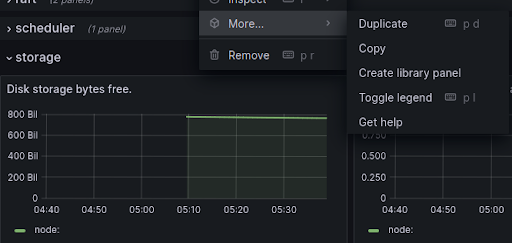

Now choose Edit on the new chart. In the top right corner, change "Time series" to "Stat":

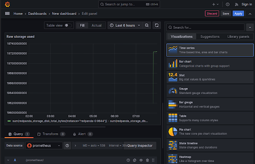

You can also scroll down to the Thresholds section and change the number `80` on the red entry to something higher than the current value:

```
15000000000
```

> Note: A helpful way to use thresholds is to have them match the value of any alerts created.

Your new dashboard should look something like this:


Make sure to save your new charts and dashboard by clicking the "Save" icon in the top right (otherwise all your progress could be lost). Name your dashboard "Storage" and save it in the "General" folder.
